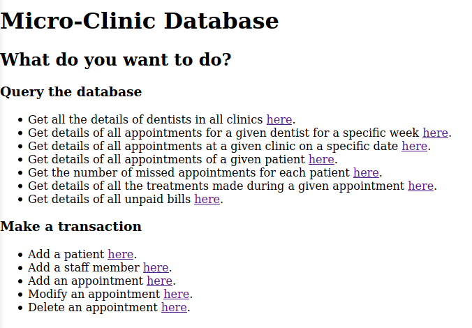
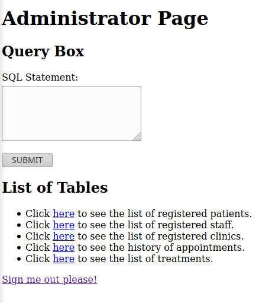

# Micro-Clinic
This application serves as the database interface for a micro dental-clinic. Users can check different 
values in the database through the first query options or perform transactions with the transaction options.

The following is the user home page 

There is also an admin page where you can perform direct MySQL queries on the database as well 
as perform transactions 

# Installation
Used XAMPP to test and run application locally. Documentation can be found [here](https://www.apachefriends.org/index.html).
To interact with application, after you've installed XAMPP, run the **.sql** files to create a database schema
and populate the database. 
